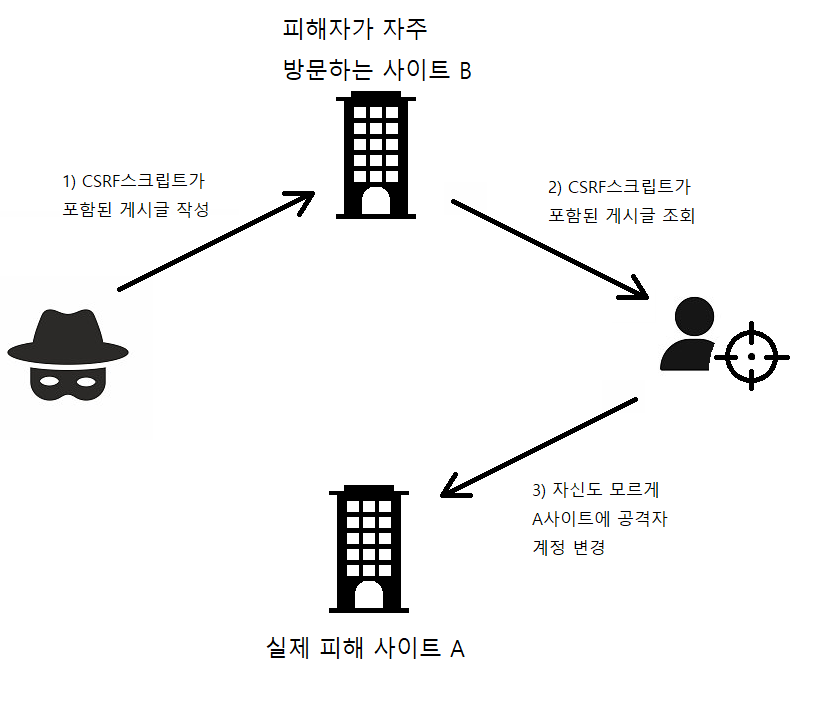

# 🙆‍♂️ 로그인과 로그아웃 처리
## ⚙ 접근 제한 설정
`<security:intercept-url>` : 특정한 URI에 접근할 때 인터셉터를 이용해 접근을 제한
- pattern : URI 패턴을 의미
- access : 권한을 체크
```xml
<!-- security-context.xml -->
<security:http>
    <security:intercept-url pattern="/sample/all" access="permitAll"/>
    <security:intercept-url pattern="/sample/member" access="hasRole('ROLE_MEMBER')"/>

    <security:form-login/>
</security:http>

<security:authentication-manager/>
```
*/sample/member 접근 시 스프링 시큐리티가 기본으로 제공하는 로그인 페이지(/login)로 이동*

## 📱 단순 로그인 처리
※ 스프링 시큐리티가 사용하는 username이나 User의 의미가 일반적인 시스템에서와 차이가 있다   
- 보통 시스템에서 사용자 아이디를 의미하는 <font style='color:skyblue'>userid</font>는 스프링 시큐리티에서는 <font style='color:skyblue'>username</font>에 해당</font>
- 스프링 시큐리티의 **<font style='color:orange'>User</font>는 인증 정보와 권한을 가진 객체**이므로 일반적인 경우에 사용하는 사용자 정보와는 다른 의미이다.   

인증 권한에 대한 실제 처리는 `UserDetailsService`를 이용해 처리 XML에서는 다음과 같이 설정
```xml
<!--security-context.xml-->
<security:authentication-manager>
    <security:authentication-provider>
        <security:user-service>
            <!--member라는 계정 정보를 가진 사용자가 로그인을 가능케 함-->
            <security:user name="member" password="member" authorities="ROLE_MEMBERS"/>
        </security:user-service>
    </security:authentication-provider>
</security:authentication-manager>
```
에러가 나는 이유는 5버전 부터 반드시 `PasswordEncoder`를 이용하도록 변경됨
인코딩 처리 없이 사용하고 싶다면 패스워드 앞에 `{noop}` 문자열 추가.
```xml
<!--security-context.xml-->
<security:user name="member" password="{noop}member" authorities="ROLE_MEMBERS"/>
```
### ✔ 로그아웃 확인
브라우저에서 유지하고 있는 세션과 관련된 정보를 삭제   
개발자도구 -> Application -> Cookies -> JSESSIONID삭제

### ✔ 여러 권한을 가지는 사용자 설정
```xml
<!--security-context.xml-->
<security:intercept-url pattern="/sample/admin" access="hasRole('ROLE_ADMIN')"/>

<security:user name="admin" password="{noop}admin" authorities="ROLE_MEMBER, ROLE_ADMIN"/>
```

### ✔ 접근 제한 메시지 처리
- 특정 URI 지정
```xml
<!--security-context.xml-->
<!--/accessError로 접근 제한 시 보이는 화면 처리-->
<security:access-denied-handler error-page="/accessError" />
```
```java
@GetMapping("/accessError")
public void accessDenied(Authentication auth, Model model)
{
    log.info("access Denied : " + auth);
    model.addAttribute("msg", "Access Denied");
}
```
```jsp
<!--accessError.jsp-->
<h1>Access Denied Page</h1>
<h2><c:out value="${SPRING_SECURITY_403_EXCEPTION.getMessage()}"/></h2>
<h2><c:out value="${msg}"/></h2>
```
에러 메시지 대신 accessError.jsp의 내용이 보이게 된다.  
JSP에서는 `HttpRequest` 안에 `SPRING_SECURITY_403_EXCEPTION`이라는 이름으로 `AccessDeniedException` 객체가 전달된다.      

- `AccessDeniedHandler` 직접 구현 (접근 제한이 된 경우 다양한 처리를 하고 싶은 경우)   

    ex) 접근 제한이 되었을 때 쿠키나 세션에 특정 작업 추가, `HttpServletResponse`에 특정한 헤더 정보를 추가 등

```xml
<!--security-context.xml-->
<bean id="customAccessDenied" class="org.tmkim.security.CustomAccessDeniedHandler" />

<!--<security:access-denied-handler error-page="/accessError" />-->
<security:access-denied-handler ref="customAccessDenied" />
```
```java
//접근 제한에 걸리는 경우 리다이렉트
public class CustomAccessDeniedHandler implements AccessDeniedHandler
{
    @Override
    public void handle(HttpServletRequest request, HttpServletResponse response, AccessDeniedException accessDeniedException) throws IOException, ServletException
    {
        response.sendRedirect("/accessError");
    }
}
```
`AccessDeniedHandler` 인터페이스의 `handle()` 메서드는 `HttpServletRequest, HttpServletResponse`를 파라미터로 사용하기 때문에 <u>직접적으로 서블릿 API를 이용</u>하는 처리가 가능하다.

## 🔧 커스텀 로그인 처리
```xml
<!--<security:form-login/>-->
<!--GET 방식으로 접근하는 URI 지정-->
<security:form-login login-page="/customLogin"/>
```
```java
@GetMapping("/customLogin")
public void loginInput(String error, String logout, Model model)
{
    if(error != null)
        model.addAttribute("error", "Login Error Check Your Account");

    if(logout != null)
        model.addAttribute("logout", "Logout!!");
}
```
```html
<!--실제 로그인의 처리 작업은 /login을 통해 이뤄짐(구현x)-->
<form method="post" action="/login">
    <div>
        <input type="text" name="username" value="admin">
    </div>
    <div>
        <input type="password" name="password" value="admin">
    </div>
    <div>
        <input type="submit"/>
    </div>
    <input type="hidden" name="${_csrf.parameterName}" value="${_csrf.token}"/>
</form>
```

## ⚔ CSRF(Cross-site request forgery) 공격과 토큰
스프링 시큐리티에서 **POST** 방식을 이용하는 경우 기본적으로 **CSRF 토큰**이 사용되는데 **사이트간 위조 방지**를 목적으로 특정한 값의 토큰을 사용하는 방식이다.   

<u>CSRF 공격</u>이란, 서버에서 받아들이는 정보가 특별히 사전 조건을 검증하지 않는다는 단점을 이용하는 공격 방식이다.

> 예를 들어 A사이트가 존재한다고 가정하면,    
> A 사이트에는 특정 사용자의 등급을 변경하는 URI가 존재하는 것을 공격자가 알았고, 해당 URI에는 약간의 파라미터가 필요하다는 것을 알았다고 가정
>
> www.aaa.xxx/update?grade=admin&account=123
>
> 공격자는 A 사이트의 관리자(피해자)가 자주 방문하는 B 사이트에 `` 태그나 `<form>` 태그를 이용해서 위의 URI를 추가한 게시물을 작성한다
>```html
><form action="www.aaa.xxx/update?grade=admin&account=123">
>    <input type="submit" value="x xx xx x x x">
></form>
>
>```
> A 사이트의 관리자는 자신이 평상시 방문하던 B 사이트를 방문하게 되고 공격자가 작성한 게시물을 보게 된다.
> 이때 `` 태그 등에 사용된 URI가 호출되고 서버에서는 로그인한 관리자의 요청에 의해서 공격자는 admin 등급의 사용자로 변경된다.   
>   
> A 사이트의 관리자는 자신이 관리하던 A 사이트에 로그인이 되어 있는 상태라면 A 사이트의 서버 입장에서는 로그인한 사용자의 정상적인 요청으로 해석된다.   
> CSRF 공격은 서버에서 받아들이는 요청을 해석하고 처리할 때 어떤 출처에서 호출이 진행되었는지 따지지 않기 때문에 생기는 허점을 노리는 공격 방식이다.   

🛡 CSRF 공격을 막는 방법
- 사용자의 요청에 대한 출처를 의미하는 refer 헤더를 체크
- 일반적인 경우에 잘 사용되지 안호 REST 방식에서 사용되는 PUT, DELETE와 같은 방식을 이용

### 📀 CSRF 토큰
사용자가 임의로 변하는 특정한 **토큰값**을 서버에서 체크하는 방식   
서버에서 생성하는 **토큰**은 일반적으로 난수를 생성해서 공격자가 패턴을 찾을 수 없도록 한다.
1. 서버에는 브라우저에 데이터를 전송할 때 CSRF 토큰을 같이 전송
2. 사용자가 POST 방식 등으로 특정한 작업을 할 때는 브라우저에서 전송된 CSRF 토큰의 값과 서버가 보관하고 있는 토큰의 값을 비교
3. 만일 CSRF 토큰의 값이 다르다면 작업을 처리하지 않는 방식

*공격자의 입장에서는 CSRF 공격을 하려면 변경되는 CSRF 토큰의 값을 알아야만 하기 때문에 고정된 내용의 `<form>`태그나 ``태그 등을 이용할 수 없게 된다.*

### ✔ 스프링 시큐리티의 CSRF 설정
일반적으로 CSRF 토큰은 세션을 통해서 보관하고, 브라우저에서 전송된 CSRF 토큰값을 검사하는 방식으로 처리한다.   
```xml
<security:csrf disabled="true" />
```

## 🔒 로그인 성공과 AuthenticationSuccessHandler
로그인 성공 후 특정 동작을 하도록 제어하고 싶은 경우가 있다.   
ex) 로그인할 때 'id:admin/pw:admin'으로 로그인 했다면, 무조건 'sample/admin'으로 이동하게 하거나, 별도의 쿠키 등을 생성해서 처리하고 싶은 경우   
스프릥 시큐리티에서는 `AuthenticationSuccessHandler`라는 인터페이스를 구현해서 설정 가능

```java
//CustomLoginSuccessHandler
@Log4j2
public class CustomLoginSuccessHandler implements AuthenticationSuccessHandler
{
    @Override
    public void onAuthenticationSuccess(HttpServletRequest request, HttpServletResponse response, Authentication auth) throws IOException, ServletException
    {
        // 사용자가 가진 모든 권한 추가
        List<String> roleNames = new ArrayList<>();
        auth.getAuthorities().forEach(authority ->{
            roleNames.add(authority.getAuthority());
        });

        if(roleNames.contains("ROLE_ADMIN"))
        {
            response.sendRedirect("/sample/admin");
            return;
        }

        if(roleNames.contains("ROLE_MEMBER"))
        {
            response.sendRedirect("/sample/member");
            return;
        }
    }
}
```

```xml
<!--security-context.xml-->
<!--로그인 성공 후 처리를 담당하는 핸들러 지정-->
<bean id="customLoginSuccess" class="org.tmkim.security.CustomLoginSuccessHandler" />

<!--<security:http> 내부에 추가-->
<security:form-login login-page="/customLogin" authentication-success-handler-ref="customLoginSuccess"/>
```

## 🔓 로그아웃 처리와 LogoutSuccesshandler
로그인과 마찬가지로 특정한 URI 지정하고, 로그아웃 처리 후 직접 로직을 처리할 수 있는 핸들러를 등록할 수 있다.
```xml
<security:logout logout-url="/customLogout" invalidate-session="true"/>
```
```java
// CommonController
@GetMapping("/customLogout")
public void logoutGET(){ }
```
```html
<!--customLogout.jsp-->
<h1>Logout Page</h1>

<form method="post" action="/customLogout">
    <!--POST 방식으로 처리되기 때문에 CSRF 토큰값을 같이 지정-->
    <input type="hidden" name="${_csrf.parameterName}" value="${_csrf.token}" />
    <button>로그아웃</button>
</form>
```
POST 방식으로 처리되는 로그아웃은 스프링 시큐리티의 내부에서 동작한다.   
로그아웃 시 추가적인 작업을 해야 한다면 `LogoutSuccessHandler`를 정의해서 처리한다.