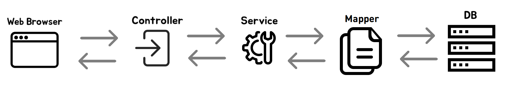

# SpringMVC - MyBatis의 처리 흐름
> 
> 1. 웹 브라우저는 URL을 이용하여 요청을 보낸다.
> 2. Controller는 웹 브라우저의 요청을 처리 컨트롤러가 서비스를 호출한다.
> 3. Service는 비즈니스 로직을 처리한다. 데이터 베이스에 접근하는 Mapper를 이용하여 DB의 결과값을 받아온다.
> 4. Mapper는 데이터베이스에 접속하여 비즈니스 로직 실행에 필요한 쿼리를 호출한다
> 5. DB에서 알맞은 쿼리를 실행 후 결과값을 반환한다.