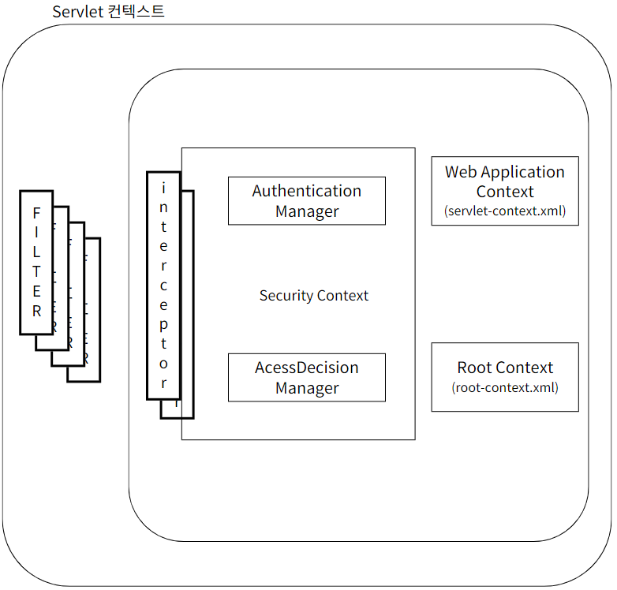
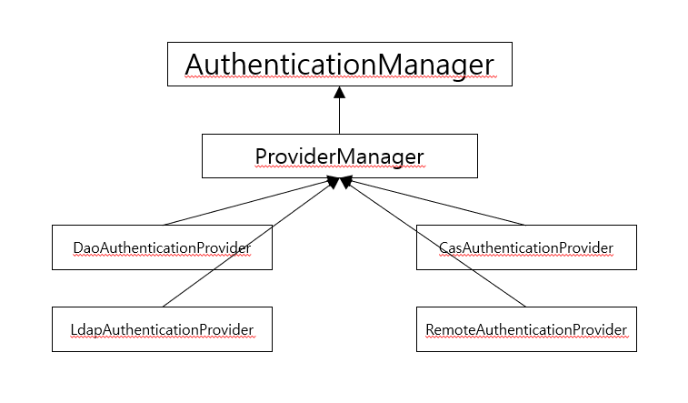
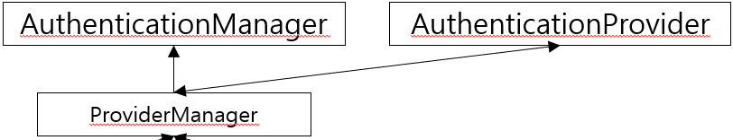
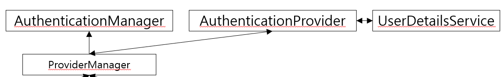

# 🔒Spring Web Security

## 📋Spring Web Security 소개
기본 동작 방식은 서블릿의 여러 종류의 **필터**와 **인터셉터**를 이용해 처리  
- 필터 : 서블릿에서 말하는 단순한 필터(스프링과 무관한 서블릿 자원)    
    
- 인터셉터 : 스프링에서 필터와 유사한 역할(스프링 빈으로 관리되면서 스프링의 컨텍스트 내에 속함)    
    
###### 참고 : https://mangkyu.tistory.com/173
- #### 스프링 시큐리티가 적용된 스프링 MVC 프로젝트의 구조
 

---

### ⚙ Spring Web Security 설정
1. 의존성 추가
- `org.springframework.security.spring-security-core`
- `org.springframework.security.spring-security-config`
- `org.springframework.security.spring-security-web`
- `org.springframework.security.spring-security-taglibs`
2. security-context.xml 생성
- `xmlns:security="http://www.springframework.org/schema/security"`
- `xsi:schemaLocation="http://www.springframework.org/schema/security"`
- `xsi:schemaLocation="http://www.springframework.org/schema/security/spring-security.xsd"`
3. web.xml 설정(필터를 이용해 스프링 동작에 관여하도록 설정)
```xml
<!-- web.xml -->
<context-param>
    <param-name>contextConfigLocation</param-name>
    <param-value>
        /WEB-INF/spring/root-context.xml
        /WEB-INF/spring/security-context.xml
    </param-value>
</context-param>

<filter>
    <filter-name>springSecurityFilterChain</filter-name>
    <filter-class>org.springframework.web.filter.DelegatingFilterProxy</filter-class>
</filter>

<filter-mapping>
    <filter-name>springSecurityFilterChain</filter-name>
    <url-pattern>/*</url-pattern>
</filter-mapping>
```
```xml
<!-- security-context.xml -->
<security:http>
    <security:form-login/>
</security:http>

<security:authentication-manager/>
```

### 📝 시큐리티가 필요한 URI 설계
- /sample/all : 로그인을 하지 않은 사용자도 접근 가능한 URI
- /sample/member : 로그인 한 사용자들만 접근할 수 있는 URI
- /sample/admin : 로그인 한 사용자들 중 관리자 권한을 가진 사용자만 접근할 수 있는 URI

### 🔓 인증(Authentication)과 권한 부여(Authorization - 인가)
- 인증(Authentication) : 자신을 증명하는 것, 스스로 자신을 증명할 만한 자료를 제시
- 인가(Authorization) : 남에 의해서 자격이 부여 됨   

#### AuthenticationManager (인증을 담당)
`AuthenticationManager`는 다양한 방식의 인증을 처리할 수 있도록 아래와 같이 설계 됨


`ProviderManager`는 인증에 대한 처리를 `AuthenticationProvider`라는 타입의 객체를 이용해 처리를 위임한다.


`AuthenticationProvider`(인증 제공자)는 실제 인증 작업을 진행한다. <br> 이때 인증된 정보에는 권한에 대한 정보를 같이 전달하게 되는데 이 처리는 `UserDetailsService` 인터페이스의 구현체가 실제로 사용자의 정보와 사용자가 가진 권한의 정보를 처리해서 반환하게 된다.


※ 스프링 시큐리티를 커스터마이징 하는 방식
- `AuthenticationProvider`를 직접 구현하는 방식 : 새로운 프로토콜이나 인증 구현 방식을 직접 구현하는 경우에 사용
- `UserDetailsService`를 구현하는 방식